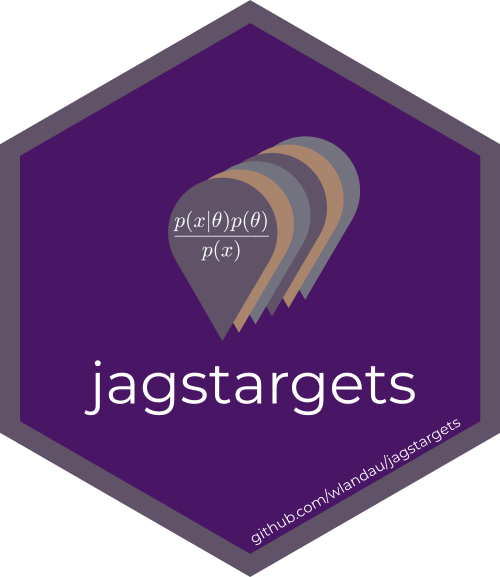

```{r setup, include=FALSE}
knitr::opts_chunk$set(echo = FALSE)
```

<table>

<tr>
<th>
[](https://docs.ropensci.org/targets)
</th>
<th style="font-weight:normal;">
<br>
[](https://www.repostatus.org/#active) [`targets`](https://docs.ropensci.org/targets) is the core engine of the targetopia. It learns the components of your data analysis project, runs the work with distributed computing, and skips steps that are already up to date. It reduces the runtime of successive runs, and it shows tangible evidence that your results match the underlying code and data.<br><br>
</th>
</tr>

<tr>
<th>
[](https://docs.ropensci.org/tarchetypes)
</th>
<th style="font-weight:normal;">
<br>
[](https://www.repostatus.org/#active)
[`tarchetypes`](https://docs.ropensci.org/tarchetypes) makes it easy to add certain kinds of common tasks to reproducible pipelines. Most of its [functions](https://docs.ropensci.org/tarchetypes/reference/index.html) create families of targets for [parameterized R Markdown](https://docs.ropensci.org/tarchetypes/reference/tar_render_rep.html), [simulation studies](https://docs.ropensci.org/tarchetypes/reference/tar_rep.html), and other general-purpose scenarios.<br><br>
</th>
</tr>

<tr>
<th>
[](https://docs.ropensci.org/stantargets/)
</th>
<th style="font-weight:normal;">
<br>
[](https://www.repostatus.org/#active) 
[`stantargets`](https://docs.ropensci.org/stantargets/) is a workflow framework for Bayesian data analysis with [`cmdstanr`](https://mc-stan.org/cmdstanr/). With concise, easy-to-use syntax, it defines versatile families of targets tailored to Bayesian statistics, from a [single MCMC run with postprocessing](https://docs.ropensci.org/stantargets/articles/mcmc.html) to [large simulation studies](https://docs.ropensci.org/stantargets//articles/mcmc_rep.html).
<br><br>
</th>
</tr>

<tr>
<th>

</th>
<th style="font-weight:normal;">
<br>
[](https://www.repostatus.org/#active) Like [`stantargets`](https://docs.ropensci.org/stantargets), [`jagstargets`](https://wlandau.github.io/jagstargets) is a workflow framework for Bayesian data analysis, with support for both single MCMC runs and large-scale simulation studies. It invokes [JAGS](http://mcmc-jags.sourceforge.net/) through the [`R2jags`](https://github.com/suyusung/R2jags) package, which has nice features such as the ability to parallelize chains across local R processes.
<br><br>
</th>
</tr>

<tr>
<th>
[](https://njtierney.github.io/geotargets/)
</th>
<th style="font-weight:normal;">
<br>
[](https://www.repostatus.org/#wip) The `geotargets` package is a `targets` workflow framework for geospatial data, focusing on the integration between `targets` and geospatial storage formats. It currently supports raster and vector formats created by `terra` and is progressively adding support for `sf`, and `stars`. For example, `tar_terra_rast()` allows you to work with `terra` `SpatRaster` objects.
<br><br>
</th>
</tr>

<tr>
<th style="text-align: center">
[`nlmixr2targets`](https://github.com/nlmixr2/nlmixr2targets)
</th>
<th style="font-weight:normal;">
<br>
[](https://www.repostatus.org/#wip) [`nlmixr2targets`](https://github.com/nlmixr2/nlmixr2targets) accommodates [`nlmixr2`](https://github.com/nlmixr2/nlmixr2)-powered pharmacometrics analysis workflows for reproducibility and minimal rework with changes to data.
<br><br>
</th>
</tr>

<tr>
<th style="text-align: center">
[`sqltargets`](https://github.com/daranzolin/sqltargets)
</th>
<th style="font-weight:normal;">
<br>
[](https://www.repostatus.org/#wip) `sqltargets` makes it easy to integrate SQL files within your `targets` workflows. The shorthand `tar_sql()` creates two targets: (1) the 'upstream' SQL file; and (2) the 'downstream' result of the query. Dependencies can be specified by calling `tar_load()` within SQL comments. Parameters can be specified using `glue::glue_sql()` bracket notation ('{}').   
<br><br>
</th>
</tr>

<tr>
<th>
[](https://overdodactyl.github.io/redcaptargets)
</th>
<th style="font-weight:normal;">
<br>
[](https://www.repostatus.org/#wip)
[`redcaptargets`](https://overdodactyl.github.io/redcaptargets) is a [`targets`](https://docs.ropensci.org/targets) workflow framework for integrating data from [REDCap](https://project-redcap.org/) databases. [`tar_redcap()`](https://overdodactyl.github.io/redcaptargets/reference/tar_redcap.html) dynamically creates targets for each REDCap instrument, as well as metadata and other supplemental information. Flexible cue strategies support efficient updates, including the use of REDCap project logs to detect changes and avoid unnecessary data pulls.<br><br>
</th>
</tr>

<tr>
<th style="text-align: center">
`brmstargets`
</th>
<th style="font-weight:normal;">
<br>
[](https://www.repostatus.org/#concept) `brmstargets` is an idea first proposed [here](https://github.com/ropensci/stantargets/issues/12#issuecomment-747836678). An implementation is planned, but no work has started. The goal is to accommodate [`brms`](https://github.com/paul-buerkner/brms)-powered Bayesian data analysis workflows just as [`stantargets`](https://docs.ropensci.org/stantargets/) enhances [`cmdstanr`](https://mc-stan.org/cmdstanr/).
<br><br>
</th>
</tr>

<tr>
<th style="text-align: center">
Other ideas
</th>
<th style="font-weight:normal;">
<br>
Following precedent of [`stantargets`](https://docs.ropensci.org/stantargets/), it should be possible to extend the R Targetopia to more methodology packages whose users face intense computation, long runtimes, and rapid changes. Possibilities include [`greta`](https://greta-stats.org), [`nimble`](https://r-nimble.org), [`keras`](https://keras.rstudio.com), [`torch`](https://torch.mlverse.org), [`torchvision`](https://github.com/mlverse/torchvision), [`tidymodels`](https://github.com/tidymodels/tidymodels), [`mlr3`](https://mlr3.mlr-org.com/), and [`nlmixr2`](https://github.com/nlmixr2/nlmixr2). In addition, following [this thread](https://github.com/ropensci/tarchetypes/discussions/46), there may be need for a literate-programming-focused package with target factories outside the scope of `tarchetypes`.
</ul>
<br><br>
</th>
</tr>

</table>
